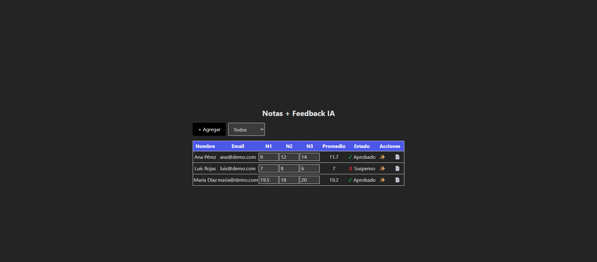
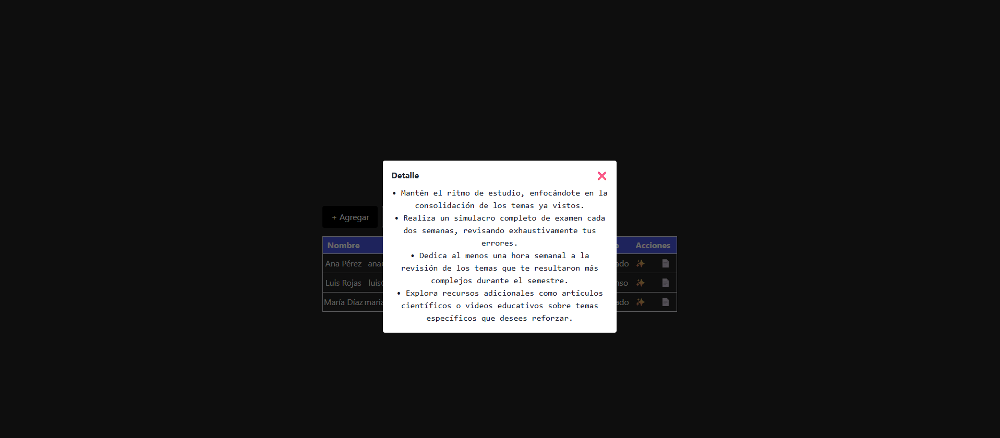
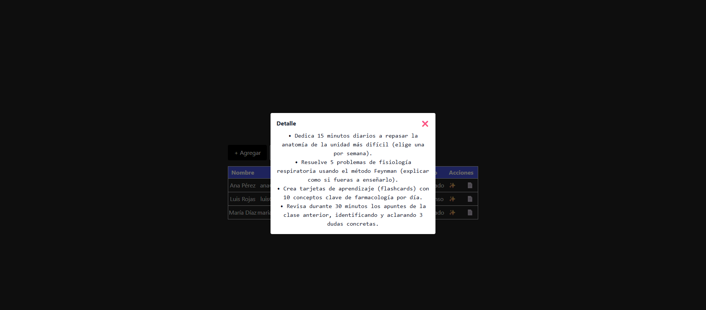

# Vue 3 + Vite
# 📚 MiniApp Notas + Feedback IA (Vue 3 + Tailwind + Gemini)

## 📌 Descripción
Miniaplicación desarrollada en **Vue 3** que permite gestionar estudiantes, sus notas y estado (Aprobado/Suspenso), con integración de **IA (Google Gemini)** para generar recomendaciones personalizadas según el rendimiento.

Esta aplicación fue desarrollada como parte de una **prueba técnica de integración de IA**. El feedback se genera de forma **segura** a través de un backend en **Node.js + Express**, evitando exponer la API Key en el cliente.

---

## 🛠 Tecnologías utilizadas
- **Frontend**:
  - Vue 3 + Vite
  - TailwindCSS 3.3.5
- **Backend**:
  - Node.js + Express
  - @google/generative-ai (SDK oficial de Gemini)
  - CORS, Rate limiting y Zod para validaciones

---

## 📂 Estructura del proyecto
```
miniapp-ia/
│── src/
│   ├── components/
│   │   └── NotasFeedbackIA.vue    # Componente principal
│   ├── App.vue
│   ├── main.js
│   └── index.css                  # Estilos con Tailwind
│
│── server/
│   └── index.js                   # Backend con integración Gemini
│
│── .env                            # Variables de entorno (NO subir al repo)
│── package.json
│── tailwind.config.js
│── postcss.config.js
```

---

## ⚙️ Instalación

### 1️⃣ Clonar repositorio
```bash
git clone https://github.com/jhonnyso2000/MiniApp-Notas-Feedback-IA.git
cd MiniApp-Notas-Feedback-IA
```

### 2️⃣ Instalar dependencias del frontend
```bash
npm install
```

### 3️⃣ Instalar dependencias del backend
```bash
npm install express cors express-rate-limit zod dotenv @google/generative-ai
```

### 4️⃣ Configurar variables de entorno
Crear archivo `.env` en la raíz:
```
GEMINI_API_KEY=TU_API_KEY_DE_GEMINI
PORT=3001
ALLOWED_ORIGIN=http://localhost:5173
```
> ⚠️ No subir `.env` a repositorios públicos.

---

## 🚀 Ejecución

### 1️⃣ Levantar el backend (Gemini)
```bash
node server/index.js
```
El servidor escuchará en:
```
http://localhost:3001
```

### 2️⃣ Levantar el frontend (Vue)
En otra terminal:
```bash
npm run dev
```
La app estará disponible en:
```
http://localhost:5173
```

---

## 💡 Uso
1. En la tabla, edita las notas de un estudiante para recalcular su promedio y estado.
2. Pulsa **✨** para generar recomendaciones personalizadas con IA (Gemini).
3. Pulsa **📄** para ver el último feedback guardado sin volver a solicitarlo.
4. Filtra estudiantes por estado usando el selector "Todos / Aprobado / Suspenso".
5. Usa **+ Agregar** para añadir un estudiante vacío.

---

## 🔒 Seguridad
- La **API Key** de Gemini se mantiene **solo en el backend**.
- Se usa **Rate limiting** para evitar abuso.
- Se valida el formato de datos con **Zod**.
- **CORS** restringe el acceso solo al origen configurado.

---

## 📝 Notas adicionales
- Tailwind está configurado para escanear `./src/**/*.{vue,js,ts}` y `index.html`.
- El modal y la tabla tienen estilos adaptados para buena legibilidad.

---

## ⚠️ Problemas comunes

### ❌ Error `503 Service Unavailable` en Gemini
**Causa**: El modelo (`gemini-1.5-flash`) está saturado y no puede responder en ese momento.  
**Soluciones**:
1. Esperar unos minutos y reintentar.
2. Cambiar temporalmente a otro modelo menos saturado:
```js
const model = genAI.getGenerativeModel({ model: "gemini-pro" });
```
3. Implementar reintentos automáticos y/o un fallback simulado en el backend para no interrumpir la demo.

### ❌ Problemas con Tailwind en Windows
Si `npx tailwindcss init -p` falla, instalar la versión estable anterior:
```bash
npm uninstall tailwindcss
npm install -D tailwindcss@3.3.5 postcss autoprefixer
npx tailwindcss init -p
```

---

## 📷 Capturas
Vista general del proyecto

Resultado para nota 19.2

Resultado para nota 7


---
